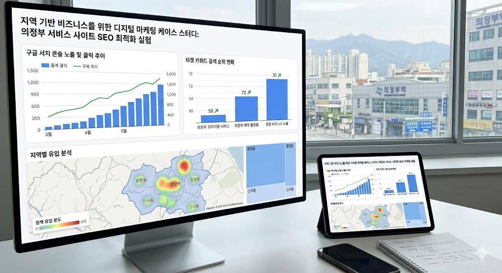

# 지역 기반 비즈니스를 위한 디지털 마케팅 케이스 스터디: 의정부 서비스 사이트 SEO 최적화 실험

본 리포지토리는 로컬 비즈니스의 온라인 노출을 극대화하기 위한 **디지털 마케팅 및 검색 엔진 최적화(SEO) 실험 과정**을 기록합니다.

## 1. 프로젝트 개요
경기 북부(의정부) 지역을 기반으로 운영되는 서비스 플랫폼을 대상으로, 구글과 네이버 등 주요 검색 엔진에서의 노출 전략을 연구합니다. 아임웹(Imweb) 및 클릭앤(Clickn) 환경에서 어떻게 구조적인 기술 최적화를 진행했는지 공유합니다.

## 2. 실험 대상 사이트
* **타겟 도메인:** [의정부 프리미엄 서비스 플랫폼](https://ujbhp.clickn.co.kr/)
* **비즈니스 모델:** 의정부 로컬 기반 정보 제공 및 예약 플랫폼
* **주요 최적화 포인트:**
  * 지역 키워드 기반 메타 데이터 및 콘텐츠 최적화
  * 구글 서치 콘솔(GSC) 및 네이버 서치 어드바이저 인덱싱 최적화
  * 구조화 데이터(Schema Markup)를 활용한 지역 비즈니스 권위(Authority) 강화

## 3. 마케팅 성과 및 SEO 진행 상황
- [x] 구글 서치 콘솔 기술적 오류 해결 완료
- [x] 지역 밀착형 콘텐츠를 활용한 백링크 네트워크 구축
- [x] 검색 엔진 인덱싱 속도 및 노출 키워드 범위 확장 실험 중

## 4. 결론
디지털 환경에서의 노출은 이제 소상공인과 로컬 비즈니스에 있어 필수적인 마케팅 수단입니다. 본 프로젝트는 실제 운영 데이터를 바탕으로 사용자 경험(UX)과 검색 엔진 순위 간의 상관관계를 추적하는 테스트베드 역할을 수행합니다.

---
*본 프로젝트는 로컬 SEO 마케팅 데이터 연구 및 기록을 위해 관리됩니다.*
